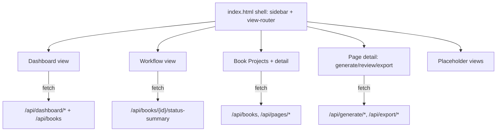

# Mockup-Based UI Refactor - Plan

## Goal Capsule

- **Objective:** Re-found the studio's web UI on the two provided mockups so they become the canonical interface, wired to the existing FastAPI backend.
- **Authority hierarchy:** The mockups (`coloring-book-studio.html`, `coloring-book-workflow.html`) are the visual source of truth. The existing backend API is the data source of truth. Where they disagree, preserve mockup look and adapt wiring.
- **Execution profile:** Two parallel Sonnet subagents (backend endpoints; frontend shell + views), integrated and verified on the main loop.
- **Stop conditions:** App serves the mockup-faithful dashboard and a live Workflow view at `/`; all currently-working features (book CRUD, page concepts, generation, review/approve, export, print-readiness) function through the new UI; unbuilt sections render as clearly-marked placeholders.

---

## Product Contract

### Summary

The current frontend (`app/static/index.html`) is a from-scratch SPA that diverged from the supplied mockups — slimmer sidebar, no Agents panel, no Inspiration/Market sections, and the production-workflow map is absent entirely. This refactor replaces that file with a UI built directly from the mockups: the dashboard mockup becomes the live app shell, and the workflow mockup becomes a navigable in-app view whose status tracker reflects real page counts. The Python backend, data model, and generation/export pipeline are unchanged except for a few read-only endpoints the richer dashboard needs.

### Problem Frame

Leslie asked for the app to be "re-founded on the HTML files provided." The provided mockups encode the intended design — sidebar taxonomy, panels, styling, and the 5-phase production workflow. The current SPA only loosely echoes them, so the studio doesn't look or navigate like the design. The fix is fidelity: rebuild the interface from the mockups and wire the parts the backend supports, without expanding backend scope.

### Requirements

Interface fidelity
- R1. The dashboard view reproduces `coloring-book-studio.html` — sidebar (Workspace / Library / Production sections), three stat cards, Active Book Projects, Recently Generated Pages, AI Agents, Quick Actions, Print Readiness, and Recent Activity — at visual parity with the mockup.
- R2. A Workflow view reproduces `coloring-book-workflow.html` — the 5-phase map, the 8-stage page-status tracker, and the three principle cards — and is reachable from the sidebar.
- R3. The two mockup files are imported into the repo so they are the canonical design reference (they currently live outside the repo root).

Live wiring
- R4. Stat cards, Active Book Projects, Recently Generated Pages, Print Readiness, and Recent Activity render from live backend data, not hardcoded sample content.
- R5. The Workflow view's page-status tracker reflects real per-status counts for the selected book.
- R6. All existing flows remain functional through the new UI: create book, edit style guide, add page concept, build prompt, generate, review/approve/request-revision, mark print-ready, export PDF.

Honest placeholders
- R7. Sidebar destinations the backend does not yet support (Page Editor, Agent Console, Inspiration, Search Market, Print Prep, Quality Check) render as clearly-marked "coming soon" placeholders that preserve the mockup's styling rather than broken or empty screens.
- R8. The AI Agents panel renders as a static descriptive list (the backend runs one generation pipeline, not five separate agent services); the Recent Activity feed is derived from real recent book/page changes.

### Scope Boundaries

- Deferred to follow-up work: building the placeholder sections into real features (agent console, inspiration library, market search, in-browser page editor); an event-log table for richer activity history; authentication.
- Outside this refactor: changes to the generation pipeline, data model, or export logic beyond the additive read endpoints below.

---

## Planning Contract

### Key Technical Decisions

- KTD1. **Single-file SPA shell, mockup-faithful.** Replace `app/static/index.html` wholesale with a new shell that copies the mockup's CSS variables, sidebar, and panel markup verbatim, then adds a thin view-router and `fetch` wiring. Keeps one served file (matches current `StaticFiles(html=True)` mount) and maximal visual fidelity.
- KTD2. **Activity derived, not logged.** Recent Activity is computed from existing `updated_at`/`status`/`created_at` columns on pages and books, sorted desc — no new table. This satisfies "activity is real" without scope creep.
- KTD3. **Agents are a static registry.** The five agents are returned from an in-code constant. The panel is descriptive; it does not imply five runtime services.
- KTD4. **Additive read endpoints only.** New endpoints live in one new router (`app/routers/dashboard.py`); no existing endpoint, model, or service changes. This lets the backend and frontend be built in parallel against a fixed contract.
- KTD5. **Mockups imported under `app/static/reference/`.** Canonical design reference travels with the repo; the live shell is derived from them but is its own file.

### Endpoint Contract (fixed, so frontend and backend parallelize)

All under `/api`, read-only, JSON.

- `GET /dashboard/stats` → `{ active_books, pages_this_week, print_ready_pages }`. `pages_this_week` = pages with `created_at` within 7 days (server clock); `print_ready_pages` = pages in `print_ready` or `exported`.
- `GET /dashboard/activity?limit=8` → `[{ text, kind, when }]` where `kind` ∈ `{approved, flagged, generated, exported, style}` (drives the dot color) and `when` is a relative string (e.g. "18m ago"). Derived per KTD2 from recent page/book changes.
- `GET /dashboard/agents` → `[{ name, description, icon, status }]`. Static per KTD3.
- `GET /dashboard/print-readiness` → `[{ book_id, title, ready_count, total_count }]` for books with at least one page.
- `GET /books/{book_id}/status-summary` → `{ idea, prompt, generated, review, revision, approved, print_ready, exported }` integer counts. Drives R5.

### High-Level Technical Design

### Sequencing

The endpoint contract above is frozen, so U2 (backend) and U3–U6 (frontend) run in parallel. U1 (import mockups) is independent. Integration and verification happen after both subagents return.

---

## Implementation Units

### U1. Import mockups into the repo
- Goal: Make the two mockups canonical in-repo design reference (R3).
- Files: copy `../coloring-book-studio.html` and `../coloring-book-workflow.html` (repo parent dir) → `app/static/reference/coloring-book-studio.html`, `app/static/reference/coloring-book-workflow.html`.
- Approach: Straight copy; no edits. These become the fidelity baseline the frontend agent diffs against.
- Test expectation: none — asset import.
- Verification: both files exist under `app/static/reference/` and open in a browser.

### U2. Backend dashboard read endpoints
- Goal: Serve the live data the dashboard and workflow views need (R4, R5, R8).
- Requirements: R4, R5, R8.
- Dependencies: none (contract fixed in Planning Contract).
- Files: create `app/routers/dashboard.py`; edit `app/main.py` (register router under `/api/dashboard` and the book status-summary route).
- Approach: New `APIRouter`. Implement the five endpoints per the Endpoint Contract using existing models and the async session (`get_db`). Activity derives from recent `Page`/`Book` rows ordered by `updated_at`; map status to `kind` and format `when` as a relative time. Agents from an in-module constant mirroring the mockup's five entries.
- Patterns to follow: existing routers in `app/routers/books.py` (async `select`, `selectinload`, `Depends(get_db)`, dict serialization helpers).
- Test scenarios:
  - `GET /dashboard/stats` on a seeded book with pages returns correct `active_books`, `pages_this_week`, `print_ready_pages`.
  - `GET /dashboard/activity?limit=8` returns at most 8 items, newest first, each with a valid `kind`.
  - `GET /dashboard/agents` returns exactly the five mockup agents.
  - `GET /dashboard/print-readiness` returns one row per book with `ready_count <= total_count`.
  - `GET /books/{id}/status-summary` counts sum to the book's page count; unknown id → 404.
- Verification: `curl` each endpoint against a running server returns 200 with the contracted shape.

### U3. Mockup-faithful app shell + dashboard view
- Goal: Replace `app/static/index.html` with the dashboard mockup as the live shell (R1, R4).
- Requirements: R1, R4, R6.
- Dependencies: U2 contract.
- Files: rewrite `app/static/index.html`.
- Approach: Copy the mockup's `:root` CSS, sidebar, and panel markup verbatim. Add a small JS view-router (show/hide sections by sidebar click) and `fetch` wiring for stats, active books, recently generated pages, print readiness, and activity. Preserve the existing app's working interactions (new-book modal, style-guide modal, add-page, generate, review, export) but re-skinned to the mockup. Keep the AI Agents panel populated from `/dashboard/agents`.
- Patterns to follow: the current `app/static/index.html` wiring logic (the `api` helper, toast, modal handlers) — port it, restyle it.
- Test scenarios:
  - Dashboard loads with live stat values matching the API.
  - Active Book Projects list renders real books with correct progress bars.
  - Clicking a sidebar item switches views without a page reload.
  - Recent Activity and Print Readiness render from their endpoints.
- Verification: load `/` in a browser; dashboard visually matches the mockup and shows live data.

### U4. Workflow view with live status tracker
- Goal: Add the workflow mockup as an in-app view with real per-status counts (R2, R5).
- Requirements: R2, R5.
- Dependencies: U2 (`status-summary`), U3 (shell/router).
- Files: `app/static/index.html` (add the Workflow view section + nav item).
- Approach: Port the workflow mockup's 5-phase map, status tracker, and principle cards into a view. Add a "Workflow" sidebar item. For the selected book (or all books aggregated when none selected), fetch `status-summary` and render counts onto the 8 tracker nodes.
- Test scenarios:
  - Workflow nav item shows the 5-phase map and 8-stage tracker.
  - Tracker node counts match `status-summary` for the selected book.
  - With no book selected, tracker shows aggregate or a neutral state (no errors).
- Verification: navigate to Workflow; counts reflect real page statuses.

### U5. Re-skin book detail, page detail, and core flows
- Goal: Carry over the working production flows under the mockup styling (R6).
- Requirements: R6.
- Dependencies: U3.
- Files: `app/static/index.html`.
- Approach: Port book-detail (page grid + status filters), page-detail (image, status track, generate/approve/revise/print-ready, notes), and export actions from the current SPA into the new shell, restyled. No backend changes.
- Test scenarios:
  - Create book → add page concept → generate → appears in review with print-check notes.
  - Approve a page → status advances; export produces a downloadable PDF.
  - Request revision moves a page to revision status.
- Verification: full core loop works end-to-end through the new UI.

### U6. Honest placeholders for unbuilt sections
- Goal: Render unsupported sidebar destinations as styled "coming soon" cards (R7).
- Requirements: R7.
- Dependencies: U3.
- Files: `app/static/index.html`.
- Approach: For Page Editor, Agent Console, Inspiration, Search Market, Print Prep, and Quality Check, show a placeholder view using mockup card styling with a brief "coming soon" message. Quality Check may instead deep-link to the review flow if trivial; otherwise placeholder.
- Test expectation: none beyond rendering — no behavior.
- Verification: each placeholder nav item shows a styled card, not a blank or broken view.

---

## Verification Contract

- Start the server: `.venv/bin/uvicorn app.main:app --host 127.0.0.1 --port 8000`.
- Backend: `curl` the five new endpoints; each returns 200 and the contracted JSON shape.
- Frontend: load `http://127.0.0.1:8000/`; dashboard matches the mockup and shows live data; Workflow view renders with real counts; placeholders render cleanly.
- Core loop: create book → style guide → add page → generate → review → approve → export PDF, all through the new UI.
- No regression: existing `/api/books`, `/api/pages`, `/api/generate`, `/api/export` endpoints still respond.

## Definition of Done

- R1–R8 satisfied.
- `app/static/index.html` is the mockup-faithful shell; the old divergent SPA is fully replaced (no dead duplicate markup left behind).
- Mockups present under `app/static/reference/`.
- New endpoints live only in `app/routers/dashboard.py` + registration in `app/main.py`; no other backend files changed.
- Server starts clean; the full core loop works end-to-end; placeholders are clearly marked.
- Abandoned experimental markup from the port is removed from the diff.
