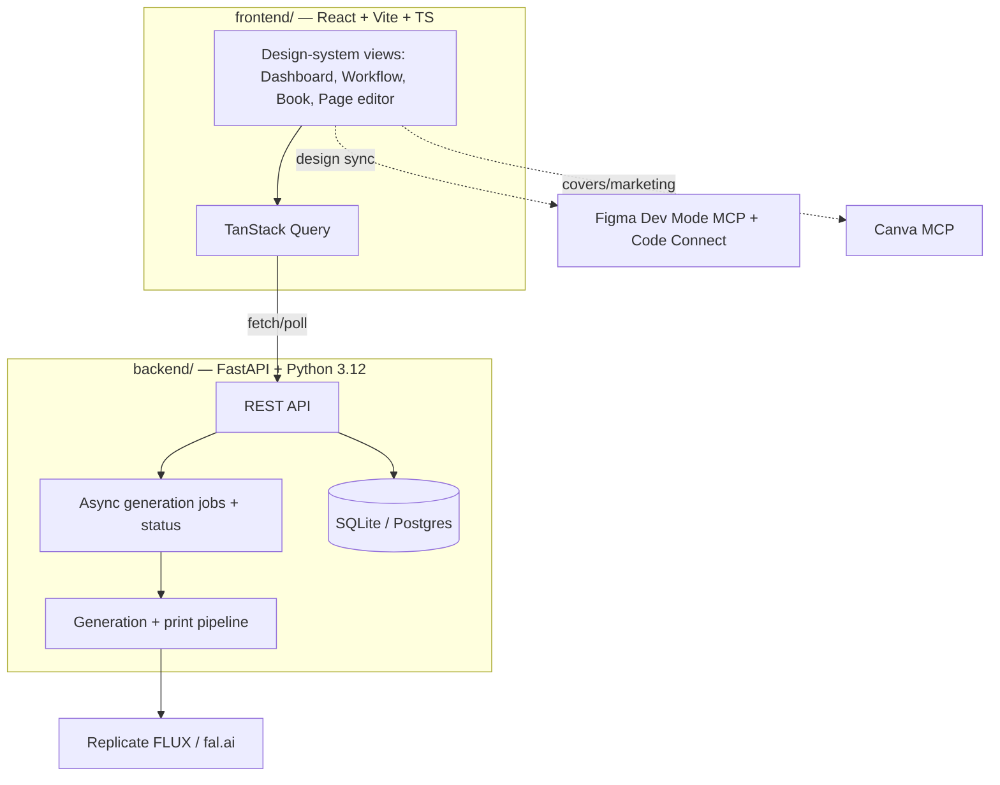
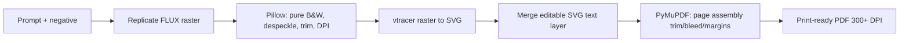

# Studio Refactor — React + Design System + Print-Quality Pipeline - Plan

Supersedes `docs/plans/2026-06-27-001-refactor-mockup-based-ui-plan.md` (narrow frontend re-base). Tech stack reference: `docs/tech-stack.md`.

## Goal Capsule

- **Objective:** Re-found the studio as a typed React + design-system frontend over a modernized FastAPI backend, and raise the actual coloring-page output to true print quality (vector line art + editable vector text + print-ready PDF).
- **Authority hierarchy:** The mockups (`app/static/reference/*.html`) are the visual baseline for the design system. `docs/tech-stack.md` is the stack contract. The existing data model and generation/export pipeline are the behavioral baseline to preserve and upgrade.
- **Execution profile:** Phased. Per the subagent-orchestration rule, fan out independent units to parallel subagents on the cheapest capable model (haiku mechanical / sonnet standard / opus for the vectorization-pipeline and design-system judgment calls); main loop integrates and verifies.
- **Stop conditions:** Frontend builds and serves all studio views under the design system; the full loop (book → style guide → generate → review → approve → export) works; exported PDFs are vector, pure-B&W, 300+ DPI with correct trim/bleed and editable text layers; tests + CI pass.

---

## Product Contract

**Product Contract preservation:** No upstream brainstorm; bootstrapped here from the user's stated goals (better UX/UI, better final results, React + design system, upgraded generation/print, Figma + Canva).

### Summary

The studio works end-to-end but the UI is a divergent vanilla SPA and the output is raster PNG. This refactor rebuilds the interface as React + TypeScript + Vite with a token-based design system derived from the mockups, modernizes the backend (Python 3.12, async generation jobs), and replaces the raster output path with a vector pipeline (vtracer → CairoSVG → PyMuPDF) that yields print-crisp, pure-B&W pages with separately editable vector text. Figma and Canva are wired via their connected MCPs for design-to-code and cover/marketing assets.

### Problem Frame

Two gaps. First, UX: the current `app/static/index.html` diverged from the mockups and is unmaintainable vanilla JS — it can't scale to the polish Leslie wants. Second, output quality: AI line art is emitted as raster PNG, which loses crispness at print scale and bakes any text into the image. Commercial print wants vector line art at 300+ DPI with text kept editable. The fix addresses both: a real frontend + design system, and a vector generation/print pipeline.

### Requirements

Foundation & developer experience
- R1. The repo separates `backend/` (FastAPI) from `frontend/` (React) with a clear boundary.
- R2. The backend runs on Python 3.12 with dependencies managed by uv (removing the 3.9 `X | None`/greenlet friction).
- R3. The frontend is React 18 + TypeScript + Vite with a token-based design system.

UX & design system
- R4. A design-token set and accessible component library, derived from the mockups, drive every screen at visual parity with `app/static/reference/coloring-book-studio.html`.
- R5. Figma Dev Mode MCP + Code Connect map the React components to Figma so design and code stay in sync.
- R6. All studio views render under the design system — Dashboard, Workflow, Book projects, Page editor — with honest "coming soon" placeholders for sections without backend support.
- R7. The UI meets a baseline of keyboard navigation, focus states, semantic markup, and contrast.

Output quality
- R8. Generation reliably produces pure black-and-white line art via stronger positive/negative prompt engineering plus raster cleanup (no gray, despeckled, trimmed).
- R9. Raster line art is vectorized to clean SVG so it prints crisply at any DPI.
- R10. Text and labels are editable vector layers (SVG `<text>`), never embedded in the AI image, composited only at export.
- R11. A book exports as a print-ready PDF with correct trim, bleed, and margins at 300+ DPI.

Async & integrations
- R12. Generation runs as an async job with a status endpoint the UI polls; the UI never blocks on a generation.
- R13. The Canva MCP exports covers/marketing assets; Figma and Canva are used via their connected MCPs.

Quality & delivery
- R14. Automated tests cover the backend API, frontend components, and the end-to-end core loop, with lint/format and CI.
- R15. The app is Dockerized and deployable; hosted deployments use Postgres + object storage (the local default stays SQLite + filesystem).

---

## Planning Contract

### Key Technical Decisions

- KTD1. **Monorepo split, not a rewrite of behavior.** `backend/` keeps the existing FastAPI app, models, and routers; `frontend/` is new. The data model and pipeline are preserved and extended, not discarded.
- KTD2. **Python 3.12 + uv.** Upgrade the runtime first so later units stop working around 3.9. Replace the venv/pip flow with uv.
- KTD3. **shadcn/ui + Tailwind for an owned design system.** Components live in-repo (not a black-box library), so tokens extracted from the mockups define the look and Figma Code Connect can map to real source.
- KTD4. **Vector pipeline replaces raster export.** Raster stays only as the generation intermediate; the print artifact is SVG → PDF. vtracer for tracing, CairoSVG for render, PyMuPDF for assembly. potrace is the fallback tracer for stubborn pure-B&W cases.
- KTD5. **Editable text as SVG `<text>`, composited at export.** Text layers stay in the DB (already modeled) and are rendered into a separate SVG layer merged with the line-art SVG at export — never rasterized into the AI image.
- KTD6. **Async jobs via status + polling first.** A `generation_job` record + `GET status` endpoint the frontend polls with TanStack Query. Defer Redis/RQ until batch generation demands it.
- KTD7. **Provider abstraction retained.** Replicate FLUX primary, fal.ai fallback, behind the existing `image_gen` seam.

### High-Level Technical Design

System topology:



Print pipeline data-flow:



### Sequencing

Phase A (foundation) gates everything. Within later phases, independent units parallelize: the design system (Phase B) and the print pipeline (Phase D) have no shared files and run concurrently; the frontend app (Phase E) depends on the design system and the backend job/print endpoints. Figma/Canva, tests, and deploy (Phase F) trail their targets.

---

## Output Structure

```
Coloring-Book-Studio/
├── backend/
│   ├── app/                  # existing FastAPI app moved here
│   │   ├── routers/          # books, pages, generate, export, dashboard, jobs
│   │   ├── services/         # image_gen, image_proc, vectorize, svg_text, pdf_export
│   │   ├── models.py
│   │   └── main.py
│   ├── tests/
│   └── pyproject.toml        # uv-managed, Python 3.12
├── frontend/
│   ├── src/
│   │   ├── components/ui/     # shadcn-based design-system components
│   │   ├── styles/tokens.*    # tokens extracted from mockups
│   │   ├── features/          # dashboard, workflow, books, pageEditor
│   │   ├── lib/api.ts         # typed client + TanStack Query hooks
│   │   └── app.tsx
│   ├── tests/                 # Vitest + Playwright
│   └── package.json           # pnpm
├── docs/
├── Dockerfile
└── docker-compose.yml
```

The per-unit Files sections are authoritative; the implementer may adjust layout if a cleaner shape emerges.

---

## Implementation Units

### Unit Index

| U-ID | Title | Key files | Depends on |
|---|---|---|---|
| U1 | Repo split + Python 3.12 + uv | `backend/`, `backend/pyproject.toml` | — |
| U2 | Frontend scaffold (React/Vite/TS/Tailwind/shadcn) | `frontend/` | U1 |
| U3 | Design tokens + core components from mockups | `frontend/src/styles`, `components/ui` | U2 |
| U4 | Figma Dev Mode + Code Connect wiring | `frontend/figma.config.*`, `components/ui` | U3 |
| U5 | Backend async generation jobs + status | `backend/app/routers/jobs.py`, `models.py` | U1 |
| U6 | Generation quality: prompts + raster cleanup | `backend/app/services/image_gen.py`, `image_proc.py` | U1 |
| U7 | Vectorization + SVG render | `backend/app/services/vectorize.py` | U6 |
| U8 | Editable vector text layers | `backend/app/services/svg_text.py`, `models.py` | U7 |
| U9 | Print PDF assembly (PyMuPDF) | `backend/app/services/pdf_export.py` | U7, U8 |
| U10 | Frontend shell + routing + Dashboard | `frontend/src/features/dashboard`, `lib/api.ts` | U3, U5 |
| U11 | Workflow view + Book/Page editor flows | `frontend/src/features/{workflow,books,pageEditor}` | U10, U8, U9 |
| U12 | Honest placeholders | `frontend/src/features/placeholders` | U10 |
| U13 | Canva covers/marketing export | `backend/app/routers/assets.py`, `frontend` | U10 |
| U14 | Tests + lint + CI | `backend/tests`, `frontend/tests`, `.github/workflows` | U9, U11 |
| U15 | Docker + deployment + storage | `Dockerfile`, `docker-compose.yml` | U9, U11 |

### U1. Repo split + Python 3.12 + uv
- Goal: Move the FastAPI app under `backend/`, upgrade to Python 3.12, manage deps with uv. (R1, R2)
- Dependencies: none.
- Files: move `app/` → `backend/app/`; create `backend/pyproject.toml`; update `run.sh`, `railway.toml`, `nixpacks.toml`; remove `X | None` workarounds now safe on 3.12.
- Approach: Create `backend/pyproject.toml` pinning Python 3.12 and current deps (drop the manual greenlet pin if uv resolves it). Keep `app.main:app` import path under the new root. Verify the existing endpoints still serve.
- Test scenarios: backend boots on 3.12; `GET /api/books` returns 200; existing dashboard endpoints respond; `uv run uvicorn` starts clean.
- Verification: server runs under 3.12 via uv; existing test/curl of core endpoints passes.

### U2. Frontend scaffold
- Goal: Stand up React 18 + TS + Vite + Tailwind + shadcn/ui with a dev proxy to the API. (R3)
- Dependencies: U1.
- Files: `frontend/` (Vite app), `frontend/package.json` (pnpm), `vite.config.ts` (proxy `/api` and `/storage` to FastAPI), `tailwind.config.ts`, shadcn init.
- Approach: Scaffold via Vite React-TS; add Tailwind + shadcn; configure dev proxy so the SPA talks to the running backend. Production build served by FastAPI static mount or a separate static host.
- Test expectation: none — scaffolding. (Smoke: dev server renders a placeholder home and proxies an API call.)
- Verification: `pnpm dev` renders; a fetch to `/api/books` succeeds through the proxy.

### U3. Design tokens + core components
- Goal: Extract tokens from the mockups and build the accessible component set the app composes from. (R4, R7)
- Dependencies: U2.
- Files: `frontend/src/styles/tokens.css`/`tailwind.config.ts` (colors, type scale, spacing, radii, shadows from the mockup `:root`), `frontend/src/components/ui/*` (Sidebar, Card, Badge, Button, StatCard, ProgressBar, Modal, Toast, PageCard, BookListItem).
- Approach: Port the mockup's CSS variables into Tailwind theme tokens. Build each component on shadcn/Radix primitives, matching the mockup's look. Components are keyboard-navigable with visible focus.
- Test scenarios: Button/Modal/Toast render all variants; Modal traps focus and closes on Esc; Badge maps each page status to the right token; contrast meets WCAG AA on text.
- Verification: a component gallery route shows the set at mockup parity; axe checks pass on the gallery.

### U4. Figma Dev Mode + Code Connect
- Goal: Connect the React components to Figma via the connected Figma MCP. (R5)
- Dependencies: U3.
- Files: `frontend/figma.config.*`, Code Connect files colocated with `components/ui/*`.
- Approach: Use the connected Figma Dev Mode MCP (resolve exact tool names via ToolSearch at execution) to set up Code Connect mapping for the core components so Dev Mode shows real source snippets. Author Code Connect for Button/Card/Badge first; expand as the set stabilizes.
- Test expectation: none — integration/config. (Manual check: Dev Mode shows the mapped component's source snippet.)
- Verification: at least the core components resolve to in-repo source in Figma Dev Mode.

### U5. Backend async generation jobs + status
- Goal: Make generation non-blocking via a job record + status endpoint. (R12)
- Dependencies: U1.
- Files: `backend/app/routers/jobs.py`, `backend/app/models.py` (add `GenerationJob`: id, page_id, status, error, result_version, timestamps), `backend/app/main.py`.
- Approach: `POST /api/pages/{id}/generate` enqueues a job (FastAPI background task initially), returns a job id; `GET /api/jobs/{id}` returns status/result. The pipeline (U6–U9) runs inside the job. Status enum: queued → running → done → failed.
- Test scenarios: enqueue returns a job id and queued status; status transitions to done with a result version on success; a forced pipeline error yields failed with an error message; polling an unknown job id → 404.
- Verification: enqueue + poll returns a completed job whose result is a generated page version.

### U6. Generation quality: prompts + raster cleanup
- Goal: Reliably produce pure-B&W line art. (R8)
- Dependencies: U1.
- Files: `backend/app/services/image_gen.py` (prompt/negative builder), `backend/app/services/image_proc.py` (cleanup).
- Approach: Strengthen the positive/negative prompt templates per researched best practice (clean black outlines, no shading, isolated on white; negatives for color/gray/shading/text). Cleanup: grayscale → threshold to pure B&W, despeckle small artifacts, autocrop/trim margins, stamp target DPI. Expose the analysis report already present.
- Test scenarios: a generated sample analyses as <1% gray pixels after threshold; despeckle removes sub-N-pixel specks; trim removes uniform borders; DPI metadata equals target; the existing print-check report flags a deliberately gray input.
- Verification: sample outputs pass the pure-B&W check and the print-check report.

### U7. Vectorization + SVG render
- Goal: Convert cleaned raster line art to clean SVG that prints crisply at any DPI. (R9)
- Dependencies: U6.
- Files: `backend/app/services/vectorize.py`.
- Approach: Trace the cleaned B&W raster with vtracer to SVG (binary/bw mode, path simplification tuned for line art); fall back to potrace for stubborn cases. Provide an SVG→PNG/PDF render via CairoSVG for previews at requested DPI. Keep both the SVG and a preview raster per version.
- Test scenarios: tracing a known B&W line drawing yields an SVG whose re-render visually matches within tolerance; output SVG has no fill-color styles (pure paths); CairoSVG renders the SVG at 300 and 600 DPI to the expected pixel dimensions; potrace fallback triggers when vtracer output exceeds a path-count threshold.
- Execution note: Add a characterization test on a fixed sample image before tuning tracer params, so quality changes are measurable.
- Verification: vectorized samples render crisp at 600 DPI with no color fills.

### U8. Editable vector text layers
- Goal: Render text layers as editable SVG `<text>`, composited separately. (R10)
- Dependencies: U7.
- Files: `backend/app/services/svg_text.py`, `backend/app/models.py` (extend `TextLayer` if needed: font, size, x/y, anchor, visible — already largely modeled).
- Approach: Build an SVG layer from a page's `TextLayer` rows (position as % of page, font, size, anchor) and merge it above the line-art SVG. Text remains real SVG `<text>` (selectable/editable), never rasterized into the AI image.
- Test scenarios: a page with two text layers produces an SVG containing two `<text>` nodes with correct content/position; hidden layers are omitted; merged SVG places text above line art; empty text set yields the line-art SVG unchanged.
- Verification: merged SVG opens with editable, correctly-placed text over the art.

### U9. Print PDF assembly (PyMuPDF)
- Goal: Assemble approved pages into a print-ready PDF with trim/bleed/margins at 300+ DPI. (R11)
- Dependencies: U7, U8.
- Files: `backend/app/services/pdf_export.py` (replace reportlab raster path), `backend/app/routers/export.py`.
- Approach: For each approved page, merge line-art SVG + text SVG (U8), place into a PyMuPDF page sized to trim + bleed with margins from the style guide; export the multi-page PDF. Vector throughout so it scales to any print size.
- Test scenarios: export of N approved pages yields an N-page PDF; page boxes match trim+bleed; text is present as selectable PDF text (vector), not an image; a book with zero approved pages returns a clear error; DPI/scale of placed vector content is correct.
- Verification: exported PDF is vector, correctly sized, with selectable text; opens in a print previewer cleanly.

### U10. Frontend shell + routing + Dashboard
- Goal: Build the app shell and the live Dashboard under the design system. (R4, R6)
- Dependencies: U3, U5.
- Files: `frontend/src/app.tsx` (router + shell), `frontend/src/lib/api.ts` (typed client + Query hooks), `frontend/src/features/dashboard/*`.
- Approach: Sidebar shell with routes; typed API client with TanStack Query hooks for books/pages/dashboard endpoints (stats, activity, agents, print-readiness). Dashboard composes the design-system components with live data.
- Test scenarios: Dashboard renders live stats/books/activity from mocked API responses; loading and error states render; sidebar navigation changes routes; the agents panel renders the static registry.
- Verification: Dashboard at mockup parity with live data via the running backend.

### U11. Workflow view + Book/Page editor flows
- Goal: Port the full production loop into the design system, including the page editor. (R6, R10)
- Dependencies: U10, U8, U9.
- Files: `frontend/src/features/workflow/*`, `frontend/src/features/books/*`, `frontend/src/features/pageEditor/*`.
- Approach: Workflow view with the 5-phase map + live status tracker (status-summary endpoint). Book detail (page grid + filters). Page editor: image/SVG preview, status track, generate (enqueue job + poll), approve/revise/print-ready, and editable text-layer controls (add/move/edit text composited per U8). Export triggers the U9 PDF.
- Test scenarios: generate enqueues a job and the UI polls to completion then shows the new version; approve advances status; editing a text layer updates the preview and persists; export downloads a PDF; Workflow tracker counts match the API.
- Verification: full loop create→generate→review→approve→export works through the new UI.

### U12. Honest placeholders
- Goal: Styled "coming soon" views for unbuilt sidebar destinations. (R6)
- Dependencies: U10.
- Files: `frontend/src/features/placeholders/*`.
- Approach: Design-system placeholder for Page Editor (if not the full editor), Agent Console, Inspiration, Search Market, Print Prep, Quality Check (or route Quality Check to the review flow).
- Test expectation: none — presentational. (Smoke: each placeholder route renders a styled card.)
- Verification: no dead or broken nav targets.

### U13. Canva covers/marketing export
- Goal: Export covers/marketing assets via the connected Canva MCP. (R13)
- Dependencies: U10.
- Files: `backend/app/routers/assets.py` (or a frontend-driven MCP call), `frontend` entry point (e.g., a book's "Create cover" action).
- Approach: From a book, invoke the connected Canva MCP (resolve tool names via ToolSearch at execution) to create/export a cover or marketing asset (PDF/PNG). Store the returned asset reference with the book.
- Test scenarios: a "create cover" action returns a Canva export reference; export format/size are as requested; failure surfaces a clear message.
- Verification: a cover asset is produced and linked to the book.

### U14. Tests + lint + CI
- Goal: Automated coverage and gates. (R14)
- Dependencies: U9, U11.
- Files: `backend/tests/*` (pytest + httpx), `frontend/tests/*` (Vitest + RTL; Playwright core-loop spec), `.github/workflows/ci.yml`, Ruff/Black/mypy + ESLint/Prettier config, pre-commit.
- Approach: Backend API tests for jobs, generation cleanup, vectorize, svg_text, pdf_export. Frontend unit tests for components and Query hooks. One Playwright E2E covering create→generate(mocked)→approve→export. CI runs lint + types + tests on push.
- Test scenarios: this unit IS the tests; CI fails on a planted lint/type/test error and passes when clean.
- Verification: CI green on a clean tree; red on a planted failure.

### U15. Docker + deployment + storage
- Goal: Reproducible container and a deployable config. (R15)
- Dependencies: U9, U11.
- Files: `Dockerfile` (multi-stage: build frontend, run backend), `docker-compose.yml` (backend + Postgres + optional Redis), update `railway.toml`.
- Approach: Multi-stage image building the Vite app and serving it from FastAPI (or a static host) with the API. Document the hosted path: Postgres + object storage (R2/S3) because Railway disk is ephemeral; local default stays SQLite + filesystem.
- Test expectation: none — packaging. (Smoke: `docker compose up` serves the app and a generation round-trips with object storage configured.)
- Verification: container builds and serves the app; storage caveat documented.

---

## Verification Contract

- Backend: `uv run pytest` green; `uv run uvicorn backend.app.main:app` boots on 3.12; `curl` of core + new endpoints returns contracted shapes.
- Pipeline: a sample page generates → vectorizes (no color fills) → composites editable text → exports a vector, pure-B&W, 300+ DPI PDF with correct trim/bleed and selectable text.
- Frontend: `pnpm build` succeeds; `pnpm test` (Vitest) green; Playwright core-loop spec passes against a mocked/real backend; axe checks pass on the component gallery.
- CI: lint (Ruff/Black/ESLint/Prettier) + types (mypy/tsc) + tests all green.

## Definition of Done

- R1–R15 satisfied.
- Repo split into `backend/` + `frontend/`; backend on Python 3.12 via uv; old vanilla `app/static/index.html` removed once the React app reaches parity (no dead duplicate UI left in the diff).
- Export path is vector end-to-end; no raster-only PDF export remains.
- All studio views render under the design system with honest placeholders; full core loop works through the new UI.
- Tests + CI green; Docker image builds and serves.
- Abandoned experimental code from the migration is removed.

---

## Scope Boundaries

### Deferred to follow-up work
- RQ/Redis job queue (until batch generation needs it; polling suffices first).
- Building the placeholder sections (agent console, inspiration, market search) into real features.
- Multi-user auth and hosting hardening beyond the documented Postgres + object-storage path.

### Outside this product's identity
- Turning the personal studio into a multi-tenant SaaS.
- In-app raster painting/coloring (the product makes printable line art, not a coloring app).

---

## Risks & Dependencies

- **vtracer line-art quality varies by input.** Mitigate with the U6 cleanup pass and a potrace fallback; characterize on fixed samples (U7) before tuning.
- **Python 3.12 dependency resolution.** Some pins may shift; uv lock surfaces conflicts early in U1.
- **Figma/Canva MCP tool surface.** Tool names/capabilities resolve at execution via ToolSearch; if a capability is missing, the design system (code) and export still stand without them.
- **Hosting storage.** Railway's ephemeral disk loses generated files/SQLite on redeploy; object storage + Postgres required for hosted use (U15).

## Sources / Research

- Vectorization: vtracer (raster→SVG, handles cleanup, pip-installable) vs potrace (B&W gold standard, fallback); render via CairoSVG; assemble via PyMuPDF. (Session web research.)
- Line-art generation: explicit "clean black outlines, no shading, isolated on white background" positives with color/gray/shading negatives; vectorize for print. (Session web research.)
- Figma Dev Mode MCP + Code Connect (real source snippets in Dev Mode) and Canva MCP (create/export PDF/PNG/etc.). (Session web research + connected MCPs.)
