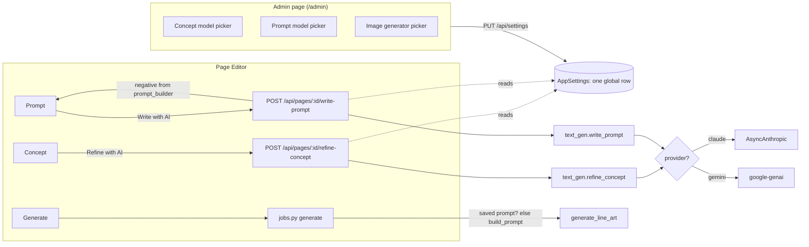

# feat: Admin Section + Per-Stage LLM Selection — Master Plan

> **Governance:** `/docs` is this project's source of truth. Before any unit, read [docs/design-system.md](../design-system.md) (UI/UX) and [docs/tech-stack.md](../tech-stack.md) (architecture/stack), and follow them. **U10 updates `/docs`** when behavior/UI changes — that unit is mandatory, not optional.
>
> **Execution:** Run via `ce-work` or `/goal`. Backend units (U1–U6) and frontend units (U7–U9) touch disjoint files and may run in parallel; U10 runs last. This plan consolidates and supersedes the standalone design spec (now archived at the `origin` path).

**Goal:** Add an Admin page to the sidebar that lets the operator choose, per pipeline stage, which LLM (a) refines & deepens the concept, (b) writes the image prompt, and (c) generates the coloring page — each as a provider + model selection.

**Architecture:** Mirror the existing image-provider pattern (`providers.py` registry + `/api/settings` + `/api/providers` + the SettingsPage picker) for a new **text**-provider stack (Claude + Gemini). Two manual, propose-then-approve actions in the Page Editor call new text endpoints. Generation is changed so a saved prompt is authoritative (the deterministic keyword builder becomes a fallback), which also unlocks AI/hand-written prompts and fixes the existing discard bug.

**Tech Stack:** FastAPI (Python 3.12, uv) · React 19 + Vite + Tailwind 4 + shadcn/ui · `google-genai` (Gemini, already present) · `anthropic` (Claude, new dependency) · Neon Postgres (prod) / SQLite (dev).

---

## Summary

Three global settings (Concept model, Prompt model, Image generator) live on one **Admin** page (the existing `/settings` page, relabelled and extended with two new sections that reuse the current picker). Two new Page-Editor buttons — **Refine with AI** (Concept) and **Write with AI** (Prompt) — call new endpoints that return proposed text for the user to accept/edit; they never auto-save. Generation uses the page's saved prompt when present, falling back to the deterministic builder. Defaults are Gemini (works with the existing key); Claude is selectable and marked recommended (`ANTHROPIC_API_KEY` is already set in Railway). The hard-coded negative prompt (no color / no shading / no copyrighted IP) is always applied as a safety rail.

---

## Problem Frame

The app's "Concept Agent" and "Prompt Engineer" in the Agent Console are decorative labels — no LLM refines the concept or writes the prompt; `build_prompt` mechanically concatenates the concept with fixed keywords, and clicking Generate overwrites any prompt edits. The operator wants real, selectable LLMs at each stage and a single place to configure them.

---

## Requirements

Traced from the approved design spec (`origin`).

- **R1** — A sidebar **Admin** entry opens a page with three provider + model pickers: Concept model, Prompt model, Image generator.
- **R2** — Selectable text providers are **Claude** (Sonnet 4.6 default/recommended, Opus 4.8) and **Gemini** (2.5 Flash default, 2.5 Pro). Each picker shows a configured/not-configured badge.
- **R3** — A **Refine with AI** action on the Concept proposes a deepened concept; the user accepts (replaces concept) or discards. Never silently overwrites.
- **R4** — A **Write with AI** action on the Prompt fills the (editable) Prompt field from the concept.
- **R5** — **Generate uses the saved prompt as-is**, falling back to the deterministic builder only when the prompt is empty (fixes the discard bug).
- **R6** — The negative prompt stays hard-coded (IP / line-art safety); the LLM writes only the positive prompt.
- **R7** — Defaults: Concept + Prompt → Gemini 2.5 Flash; Image → unchanged. Claude activates once `ANTHROPIC_API_KEY` is present.
- **R8** — Settings are global (single `AppSettings` row); no auth on Admin; no per-book overrides.
- **R9** — New behaviour/UI is reflected in `/docs` (design-system.md + architecture/API docs).

---

## Key Technical Decisions

- **KTD1 — Mirror the image-provider registry for text.** New `text_providers.py` copies the public surface of `services/providers.py` (`get_registry`, `is_configured`, `is_known_provider`, `is_valid_model`, `default_model`, `model_ids`, `DEFAULT_PROVIDER`), minus aliases. Reuses the same `{id,label,models,default_model,configured}` shape so the frontend picker and settings validation work unchanged. *Rationale:* consistency, zero new UI/validation patterns.
- **KTD2 — Generalize additive column migration to Postgres.** The existing `_apply_column_migrations` in `database.py` runs **SQLite-only**; on Neon, `create_all` will not add the new `app_settings` columns to the existing table, so settings reads would 500 in prod. Add a Postgres path using `ALTER TABLE app_settings ADD COLUMN IF NOT EXISTS …` wired into `init_db`, and register the four new columns for both engines. *Rationale:* prevents a production breakage; there is no Alembic in this repo.
- **KTD3 — Saved prompt is authoritative; builder is fallback.** In both generation paths, use `page.prompt` when non-empty else `build_prompt(...)[0]` (same for negative). *Rationale:* makes AI/edited prompts take effect and fixes the discard bug, with safe behaviour for never-generated pages.
- **KTD4 — LLM writes the positive prompt only.** The negative prompt always comes from `prompt_builder` (`UNIVERSAL_NEGATIVE` + style-guide negatives). *Rationale:* guarantees no-color / no-shading / no-IP can't be dropped by the model.
- **KTD5 — Gemini-default, Claude-recommended.** Defaulting text stages to Gemini 2.5 Flash avoids a broken first run (no Anthropic key needed); Claude is one click away and labelled recommended. *Rationale:* working-by-default beats best-by-default.
- **KTD6 — Propose-then-approve; endpoints don't persist.** `refine-concept` / `write-prompt` return text only; saving flows through the existing `PATCH /api/pages/{id}`. *Rationale:* user control; no surprise writes; reuses existing mutation.
- **KTD7 — One dispatcher for text completion.** `text_gen.complete(provider, model, system, user)` routes to `google-genai` (Gemini) or `AsyncAnthropic` (Claude); `refine_concept` / `write_prompt` are thin wrappers with coloring-book system prompts. *Rationale:* single integration seam, easy to test by monkeypatching one function.

---

## High-Level Technical Design



Three new backend pieces: a **text-provider registry** (catalogue + configured flags), a **text-gen service** (one dispatcher + two task wrappers), and **two page endpoints**. `AppSettings` gains four columns; the settings router gains a `/text-providers` route and extended serialize/update/seed. Generation reads the saved prompt first. The frontend gains a `useTextProviders` hook + two mutations, the relabelled Admin page with a reusable picker section, and the two editor buttons.

---

## Output Structure

New files (existing files modified in-place are listed per unit):

```
backend/app/services/text_providers.py     # text LLM registry (mirror of providers.py)
backend/app/services/text_gen.py           # complete() + refine_concept() + write_prompt()
backend/tests/test_text_providers.py
backend/tests/test_text_gen.py
backend/tests/test_text_endpoints.py
backend/tests/test_settings_migration.py
frontend/src/features/settings/__tests__/SettingsPage.test.tsx
frontend/src/features/editor/__tests__/PageEditorPage.test.tsx
```

---

## Implementation Units

### U1. Text-provider registry

**Goal:** A registry of selectable text LLMs with live `configured` flags, mirroring the image registry.
**Requirements:** R2, R7.
**Dependencies:** none.
**Files:**
- Create: `backend/app/services/text_providers.py`
- Test: `backend/tests/test_text_providers.py`

**Approach:** Copy the public surface of `backend/app/services/providers.py` (no aliases). Catalogue: `claude` → models `claude-sonnet-4-6` (label "Claude Sonnet 4.6 (recommended)", default) and `claude-opus-4-8` (label "Claude Opus 4.8"), `env_keys = ("ANTHROPIC_API_KEY",)`; `gemini` → models `gemini-2.5-flash` (default) and `gemini-2.5-pro`, `env_keys = ("GEMINI_API_KEY", "GOOGLE_API_KEY")`. `DEFAULT_PROVIDER = "gemini"`. `configured` = any env key set.
**Patterns to follow:** `backend/app/services/providers.py` (entry shape, `_is_configured`, `get_registry`, `is_valid_model`, `default_model`, `model_ids`, `is_known_provider`).
**Test scenarios:**
- Registry returns exactly `{claude, gemini}`; each entry has ≥1 model and a `default_model` present in its model list and a `configured` key.
- `default_model("claude") == "claude-sonnet-4-6"`; `default_model("gemini") == "gemini-2.5-flash"`.
- `is_valid_model("claude", "claude-opus-4-8")` true; `is_valid_model("gemini", "claude-opus-4-8")` false.
- `is_configured("claude")` reflects `ANTHROPIC_API_KEY` presence (monkeypatch set/unset); `is_configured("gemini")` reflects `GEMINI_API_KEY`/`GOOGLE_API_KEY`.
- `is_known_provider("openai")` false.
**Verification:** `test_text_providers.py` passes; surface matches `providers.py`.

### U2. AppSettings text columns + Postgres-capable migration

**Goal:** Persist the four new settings fields and ensure the columns exist on both SQLite (dev) and the existing Neon table (prod).
**Requirements:** R1, R8; enables R3/R4/R7.
**Dependencies:** none.
**Files:**
- Modify: `backend/app/models.py` (`AppSettings` — add `concept_provider`, `concept_model`, `prompt_provider`, `prompt_model`, String, default `""`)
- Modify: `backend/app/database.py` (extend the additive-migration mechanism to Postgres; register the four `app_settings` columns)
- Test: `backend/tests/test_settings_migration.py`

**Approach:** Add the four columns to `AppSettings`. In `database.py`, add the four columns to the SQLite `_COLUMN_MIGRATIONS` map under `app_settings`, and add a Postgres additive-migration function that issues `ALTER TABLE app_settings ADD COLUMN IF NOT EXISTS <col> VARCHAR DEFAULT ''` for each, wired into `init_db` after `create_all` on the `IS_POSTGRES` branch (mirror how `_apply_column_migrations` is invoked on the SQLite branch). Idempotent on repeat boots.
**Patterns to follow:** `backend/app/database.py` `_COLUMN_MIGRATIONS` / `_apply_column_migrations` / `init_db`; `AppSettings` column style in `backend/app/models.py`.
**Test scenarios:**
- After `init_db`, an `AppSettings` row can be created and read with all four new fields (round-trips empty strings by default).
- Simulate a legacy table missing the columns (create the table without them, then run the migration) → the four columns exist afterward and a select succeeds. *(SQLite path; note in the plan that the Postgres `ADD COLUMN IF NOT EXISTS` path is exercised at deploy against Neon.)*
- Re-running the migration is a no-op (no error).
**Verification:** `test_settings_migration.py` passes; existing suite still green.

### U3. Text generation service (+ `anthropic` dependency)

**Goal:** One async dispatcher plus two coloring-book task wrappers that call Gemini or Claude.
**Requirements:** R3, R4, R6.
**Dependencies:** U1.
**Files:**
- Create: `backend/app/services/text_gen.py`
- Modify: `backend/pyproject.toml` (add `anthropic>=0.40`; refresh `uv.lock`)
- Test: `backend/tests/test_text_gen.py`

**Approach:** `complete(provider, model, system, user) -> str` raises a clear error when the provider is not configured (via `text_providers.is_configured`), else dispatches: Gemini through `google-genai` (mirror `image_gen.py`'s `genai.Client` + `aio.models.generate_content`, read text from the response); Claude through `AsyncAnthropic` (`messages.create` with `system` + a single user message, concatenate text blocks). `refine_concept(concept, style_guide, provider, model)` uses a system prompt that deepens a coloring-book page concept (more specific drawable elements, IP-safe). `write_prompt(concept, style_guide, provider, model)` returns the **positive** line-art prompt only (no color/shading language, no copyrighted references). Negative prompt is the caller's responsibility (U5 pairs it with `prompt_builder`).
**Patterns to follow:** `backend/app/services/image_gen.py` (genai client + key resolution from `GEMINI_API_KEY`/`GOOGLE_API_KEY`); claude-api guidance for `AsyncAnthropic`.
**Test scenarios:**
- `complete` with provider `gemini` calls the genai path and returns its text (monkeypatch the client/SDK to a stub).
- `complete` with provider `claude` calls the anthropic path and returns concatenated text-block content (monkeypatch).
- `complete` with an unconfigured provider raises a clear error naming the missing env key (monkeypatch keys unset).
- `refine_concept` and `write_prompt` pass the configured provider/model through to `complete` and return its string (monkeypatch `complete`).
- `write_prompt` output is used as positive only — the function does not return color/shading directives (assert the system prompt forbids them; verify the wrapper returns the model string unchanged).
**Verification:** `test_text_gen.py` passes; `uv` resolves `anthropic`.

### U4. Settings API — text-providers route + extended settings

**Goal:** Expose the text registry and read/write the four new settings fields with validation and seeding.
**Requirements:** R1, R2, R7, R8.
**Dependencies:** U1, U2.
**Files:**
- Modify: `backend/app/routers/settings.py` (add `GET /text-providers`; extend `_serialize`, `SettingsUpdate`, `update_settings`, `get_or_create_settings`)
- Test: `backend/tests/test_settings_providers.py` (extend)

**Approach:** `GET /api/text-providers` returns `{"providers": text_providers.get_registry()}`. `_serialize` additionally returns `concept_provider/model`, `prompt_provider/model`, and per-stage `image_configured`/`concept_configured`/`prompt_configured`. `SettingsUpdate` gains the four optional text fields; `update_settings` validates them against `text_providers` (unknown provider or invalid model → 400; provider changed without a model → apply that provider's default). `get_or_create_settings` seeds the text fields from text defaults (gemini / gemini-2.5-flash) on first create.
**Patterns to follow:** existing image validation/serialize/seed in `backend/app/routers/settings.py`.
**Test scenarios:**
- `GET /api/text-providers` returns claude + gemini with models and `configured` flags.
- `GET /api/settings` includes the four text fields (defaults gemini / gemini-2.5-flash) and the three `*_configured` flags on first access.
- `PUT /api/settings` with `concept_provider=claude` (no model) sets `concept_model` to `claude-sonnet-4-6`.
- `PUT` with an invalid text model → 400; with an unknown provider → 400.
- Existing image-settings behaviour unchanged (regression).
**Verification:** extended `test_settings_providers.py` passes.

### U5. Page text endpoints — refine-concept + write-prompt

**Goal:** Endpoints that return proposed concept / prompt text without persisting.
**Requirements:** R3, R4, R6.
**Dependencies:** U3, U4.
**Files:**
- Modify: `backend/app/routers/pages.py` (add `POST /{page_id}/refine-concept`, `POST /{page_id}/write-prompt`)
- Test: `backend/tests/test_text_endpoints.py`

**Approach:** Both load the page (+ its book's style guide) and the global settings. `refine-concept` calls `text_gen.refine_concept(page.concept, style_guide, settings.concept_provider, settings.concept_model)` → `{"refined_concept": str}`. `write-prompt` calls `text_gen.write_prompt(..., settings.prompt_provider, settings.prompt_model)` for the positive prompt and `prompt_builder.build_prompt` for the negative → `{"positive": str, "negative": str}`. Neither saves. If the selected provider is not configured, return 400 with a message naming the missing key. 404 if the page doesn't exist.
**Patterns to follow:** existing handlers in `backend/app/routers/pages.py` (page+style-guide load, error shape); `get_or_create_settings` from the settings router.
**Test scenarios:**
- `POST /refine-concept` returns `{refined_concept}` from a monkeypatched `text_gen.refine_concept`; the page row is unchanged afterward (no save).
- `POST /write-prompt` returns `{positive, negative}` (positive from monkeypatched `text_gen.write_prompt`, negative non-empty from `prompt_builder`); page unchanged.
- Unconfigured provider → 400 naming the missing key (monkeypatch keys unset / `text_gen` to raise).
- Unknown page id → 404.
**Verification:** `test_text_endpoints.py` passes.

### U6. Generation respects the saved prompt

**Goal:** Use the page's saved prompt when present; fall back to the builder otherwise.
**Requirements:** R5, R6.
**Dependencies:** none (independent of U1–U5).
**Files:**
- Modify: `backend/app/routers/jobs.py` (generation around the `build_prompt` call, ~L147)
- Modify: `backend/app/routers/generate.py` (sync path, ~L57)
- Test: `backend/tests/test_api.py` (extend) or `backend/tests/test_settings_providers.py`

**Approach:** Compute the builder result once; set `positive = page.prompt or built[0]` and `negative = page.negative_prompt or built[1]`. Persist these to the page/version as today. Keep status transition and the rest of the pipeline unchanged.
**Patterns to follow:** the existing generate flow in `backend/app/routers/jobs.py`.
**Test scenarios:**
- Page with a non-empty saved `prompt` → generation uses that exact prompt (assert the value passed to `generate_line_art`, which is monkeypatched in the test fixture).
- Page with empty `prompt` → generation uses `build_prompt(concept, sg)` output (fallback).
- Saved `negative_prompt` respected when present; builder negative used when empty.
**Verification:** generation test passes; existing generation tests still green.

### U7. Frontend API client — text-provider types + hooks

**Goal:** Types and hooks for the text registry, extended settings, and the two actions.
**Requirements:** R1, R2, R3, R4.
**Dependencies:** U4, U5 (API contracts).
**Files:**
- Modify: `frontend/src/lib/api.ts`
- Test: `frontend/src/lib/__tests__/api.test.tsx` (extend)

**Approach:** Add `useTextProviders()` (`GET /text-providers`, returns `Provider[]`). Extend the `Settings` interface with `concept_provider/model`, `prompt_provider/model`, and `image_configured/concept_configured/prompt_configured` (and `useUpdateSettings` already takes `Partial<Settings>`). Add `useRefineConcept(pageId)` (`POST /pages/:id/refine-concept` → `{refined_concept}`) and `useWritePrompt(pageId)` (`POST /pages/:id/write-prompt` → `{positive, negative}`). Reuse the existing `apiFetch` and the `Provider`/`ProviderModel` types.
**Patterns to follow:** existing `useProviders`, `useSettings`, `useUpdateSettings`, `useUpdatePage`, `apiFetch` in `frontend/src/lib/api.ts`.
**Test scenarios:**
- `useTextProviders` fetches `/text-providers` and returns the providers array (mock fetch).
- `useRefineConcept` POSTs to the right URL and returns `refined_concept`.
- `useWritePrompt` POSTs and returns `{positive, negative}`.
- `Settings` type round-trips the new fields through `useUpdateSettings` (type-level + a mocked PUT assertion).
**Verification:** extended `api.test.tsx` passes; `tsc` build clean.

### U8. Admin page — relabel + reusable picker + three sections

**Goal:** Turn the Settings page into Admin with three provider+model sections; rename the nav/route.
**Requirements:** R1, R2, R7, R8, R9.
**Dependencies:** U7.
**Files:**
- Modify: `frontend/src/features/settings/SettingsPage.tsx` (extract a reusable `ProviderModelSection`; render Concept / Prompt / Image; add `ANTHROPIC_API_KEY` to the keys list; header → "Admin")
- Modify: `frontend/src/App.tsx` (footer nav label "Settings" → "Admin"; route `/settings` → `/admin`; update the route doc-comment)
- Test: `frontend/src/features/settings/__tests__/SettingsPage.test.tsx`

**Approach:** Extract the existing image picker (radio provider list + model `<select>` + Configured/Not-Configured badge + dirty-state Save) into a `ProviderModelSection` component parameterised by title, description, providers source, current provider/model, and save handler. Render three instances: **Concept Model** and **Prompt Model** (from `useTextProviders`), **Image Generation** (from `useProviders`). Each saves its own fields via `useUpdateSettings`. **Follows `docs/design-system.md`:** reuse the §4.5 radio pattern, §2.11 `<select>` styling, status `Badge`, §4.3 dirty-state Save, toasts via `@/components/ui/sonner`; no hardcoded hex; labelled selects/radios.
**Patterns to follow:** current `SettingsForm` in `frontend/src/features/settings/SettingsPage.tsx`; `docs/design-system.md` §2.11, §4.3, §4.5.
**Test scenarios:**
- Page renders three sections (Concept Model, Prompt Model, Image Generation), each with provider options and a model select.
- Changing a provider enables Save; saving calls `useUpdateSettings` with that section's fields only (mock).
- Not-configured providers show the "Not Configured" badge (e.g. Claude when key absent in the mock).
- Nav shows "Admin" and routes to `/admin` (route test / render assertion).
**Verification:** `SettingsPage.test.tsx` passes; build clean; visual matches design-system tokens.

### U9. Page Editor — Refine + Write AI buttons

**Goal:** Add the two propose-then-approve actions to the editor.
**Requirements:** R3, R4, R9.
**Dependencies:** U7.
**Files:**
- Modify: `frontend/src/features/editor/PageEditorPage.tsx`
- Test: `frontend/src/features/editor/__tests__/PageEditorPage.test.tsx`

**Approach:** Add **Refine with AI** beside the Concept: calls `useRefineConcept`, shows the proposed concept in a review box with Accept (sets the concept draft and saves via `useUpdatePage`) / Discard (closes, original kept). Add **Write with AI** beside the Prompt: calls `useWritePrompt`, opens the existing prompt editor pre-filled with the returned positive prompt (user edits/saves through the existing flow). Errors surface via toast. **Follows `docs/design-system.md`:** Button variants, CSS-var tokens, accessible labels, toast on error; the review box uses existing card/border tokens.
**Patterns to follow:** existing concept/prompt inline editors in `frontend/src/features/editor/PageEditorPage.tsx`; `docs/design-system.md` component + interaction sections.
**Test scenarios:**
- Clicking Refine calls `useRefineConcept` and renders the proposal; Accept applies it via `useUpdatePage`; Discard leaves the concept unchanged (mock the hook).
- Clicking Write calls `useWritePrompt` and opens the prompt editor pre-filled with the positive prompt (mock).
- Hook error → error toast shown, no state change.
**Verification:** `PageEditorPage.test.tsx` passes; build clean.

### U10. Update /docs (governance-mandated)

**Goal:** Reflect the new behaviour and UI in `/docs`.
**Requirements:** R9.
**Dependencies:** U1–U9 (document what was built).
**Files:**
- Modify: `docs/design-system.md` (document the new reusable UI patterns: the multi-section Admin settings layout via `ProviderModelSection`, and the "AI action button + proposal/review box" pattern; note any forbidden-pattern implications)
- Modify: `docs/tech-stack.md` (document the new backend surface: `GET /api/text-providers`; `POST /api/pages/{id}/refine-concept`; `POST /api/pages/{id}/write-prompt`; the extended `/api/settings` shape; the text-LLM provider abstraction; the "saved prompt is authoritative" generation change; `anthropic` dependency + `ANTHROPIC_API_KEY`)

**Approach:** Edit the two docs to match what shipped; if `docs/tech-stack.md` is a poor fit for API/architecture detail, create `docs/architecture.md` instead (check tech-stack.md first). No test cycle — this unit's deliverable is accurate docs.
**Test expectation:** none — documentation unit (no behavioural change).
**Verification:** the two new UI patterns appear in `design-system.md`; the new endpoints/settings/generation change appear in the architecture/API doc.

---

## Scope Boundaries

**In scope:** the three pickers, the two editor actions, the generation change, the text-provider stack, and the `/docs` update.

### Deferred to Follow-Up Work
- Per-book or per-page model overrides (global settings only for now).
- A real "Concept Agent" persona beyond single-shot refinement.
- Streaming the LLM output into the UI (synchronous request/response is sufficient).

### Out of scope
- OpenAI or any third text provider.
- Auth on the Admin page (single-operator tool).
- LLM-written negative prompts (safety rail stays hard-coded).

---

## Risks & Dependencies

- **Postgres column migration (high).** If U2's Postgres path is wrong, settings reads 500 on Neon after deploy. Mitigation: `ADD COLUMN IF NOT EXISTS` in `init_db`; verify by hitting `GET /api/settings` on the live app post-deploy.
- **`anthropic` build/deploy.** New dependency must land in `pyproject.toml` + `uv.lock` so the Docker build installs it.
- **Provider not configured.** Claude requires `ANTHROPIC_API_KEY` (already set in Railway); Gemini default keeps the feature usable regardless. Endpoints 400 clearly when a selected provider lacks its key.
- **LLM latency/cost.** Refine/Write are manual buttons (one call each) — acceptable; no batching needed.

---

## Verification Contract

- Backend: `uv run --directory backend pytest` — all existing (130) + new tests green.
- Frontend: `pnpm --dir frontend test` — all existing (46) + new tests green; `pnpm --dir frontend build` clean.
- Deploy: Railway build green; `GET /api/settings` and `GET /api/text-providers` return 200 on the live URL (confirms the Postgres migration applied).
- Manual: in Admin, set Concept + Prompt to Claude; in the editor, Refine a concept (accept), Write a prompt, then Generate and confirm the saved prompt was used.

## Definition of Done

All units U1–U10 complete; backend + frontend suites green; `pnpm build` clean; `/docs` updated (U10); deployed green with live `/api/settings` + `/api/text-providers` returning 200; both editor actions work end-to-end on **Gemini** (default) and on **Claude** (after selecting it).

---

## Sources & Research

- Origin design spec: `docs/plans/archive/2026-06-28-admin-llm-selection-design.md` (consolidated into this plan).
- Existing patterns: `backend/app/services/providers.py`, `backend/app/routers/settings.py`, `backend/app/services/prompt_builder.py`, `backend/app/services/image_gen.py`, `backend/app/routers/jobs.py` / `generate.py`, `backend/app/database.py` (migration mechanism), `backend/app/models.py` (`AppSettings`), `frontend/src/features/settings/SettingsPage.tsx`, `frontend/src/lib/api.ts`, `frontend/src/App.tsx`, `frontend/src/features/editor/PageEditorPage.tsx`.
- Governance: `docs/design-system.md`, `docs/tech-stack.md`.
- Model IDs verified via the claude-api reference (Sonnet 4.6 `claude-sonnet-4-6`, Opus 4.8 `claude-opus-4-8`).
